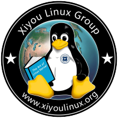

### Xiyou Linux Group 培养计划

#### 第一学期

* C/C++

* 培养方向：Linux 系统编程，网络编程，操作系统。
* 培养目标：
  1. 培养对 Linux 的兴趣并熟练使用 Linux 终端和工具。
  2. 掌握基础 Linux 系统和网络编程。
  3. 熟练一门或者多门编程语言并能进行底层应用开发。

| Time                    | Point             | Detail                                | HomeWork/Project               | Further Reading                                                       |
| ----------------------- | ----------------- | ------------------------------------- | ------------------------------ | --------------------------------------------------------------------- |
| 2021.11 ~ 2021.12.15    | Linux    基础命令 | [Cmd Q/A](preparation/cmd.md)         | [Cmd](project/cmd.md)          | 鸟哥的Linux私房菜                                                     |
| 2021.11 ~ 2021.12.15    | C        基础     | [C Reading](preparation/C.md)         | [C](project/C.md)              | [CSE251-Programming in C](https://www.cse.msu.edu/~cse251/index.html) |
| 2021.01.06 ~ 2021.01.15 | C        小项目   | [Plan2](old-Plan/Plan2.md)            | [My Strbuf](project/strbuf.md) | ---------------                                                       |
| 2022.02 ~ 2022.03.15    | Linux    目录操作 | [Plan3](old-Plan/Plan3.md)            | [My Ls](project/ls.md)         | ---------------                                                       |
| 2022.03 ~ 2022.04.03    | Linux    进程通信 | [Plan4](old-Plan/Plan4-other.md)      | [My Shell](project/shell.md)   | ---------------                                                       |
| ----                    | 高级语言 基础     | [Languages](preparation/Languages.md) | N/A                            | ---------------                                                       |
| ----                    | Linux    线程同步 | Plan5                                 | My ThreadPool                  | ---------------                                                       |
| ----                    | Linux    网络通信 | Plan6                                 | My Rpc                         | ---------------                                                       |

* Java

#### 第二，三学期

* C/C++

* 培养方向：分布式，数据库，操作系统
* 培养目标：
  1. 掌握分布式系统，数据库系统等原理并进行应用开发。
  2. 深入理解 Linux 操作系统底层原理。
  3. 理解开源文化并参与开源项目。

* Note:
  1. 下列项目不需要全做，选择你感兴趣的 3 个即可。

| Time              | Point         | Detail                                                  | Project                                                                                               | Further Reading |
| ----------------- | ------------- | ------------------------------------------------------- | ----------------------------------------------------------------------------------------------------- | --------------- |
| 2022.01 ~ 2022.12 | 网络服务器    | [Linux Network Programming](LinuxNetworkProgramming.md) | [Linux Network Programming](LinuxNetworkProgramming.md#%E8%87%AA%E6%88%91%E6%A3%80%E9%AA%8C-homework) | --------------- |
| 2022.01 ~ 2022.12 | 操作系统      | [Operator System](OS.md)                                | [Mit 6.S081](https://pdos.csail.mit.edu/6.S081)                                                       | --------------- |
| 2022.01 ~ 2022.12 | 分布式        | [Distributed System](DistributedSystems.md)             | [Mit 6.824](https://pdos.csail.mit.edu/6.824/)                                                        | --------------- |
| 2022.01 ~ 2022.12 | 关系型数据库  | [DataBase System](DB.md)                                | [Cmu 15455](15445.courses.cs.cmu.edu)                                                                 | --------------- |
| 2022.01 ~ 2022.12 | Git           | ------                                                  | My Git                                                                                                | --------------- |
| 2022.01 ~ 2022.12 | KV 外存数据库 | ------                                                  | My Lsm-tree                                                                                           | --------------- |
| 2022.01 ~ 2022.12 | KV 内存数据库 | ------                                                  | My Redis                                                                                              | --------------- |
| 2022.01 ~ 2022.12 | 云原生 容器   | ------                                                  | My Docker                                                                                             | --------------- |

* Java

<!--  Then? What's next? -->

### 结语

小组希望每个人都能在大学的四年里培养编程的兴趣，锻炼代码能力，培养独立人格，未来少被老板 PUA 或者有能力 PUA 老板。

