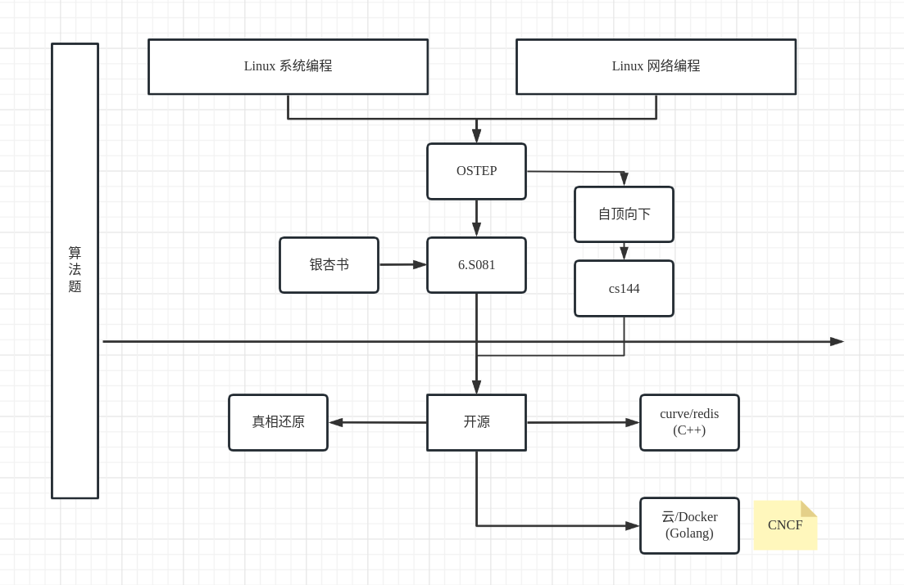

# 8 - Server 后续学习

## 必学内容

- `完整阅读` TLPI 所有章节目录。

完全没看过的章节（在别的地方看过相关内容也算看过），每章用大约 15 分钟随便看看；看过的章节直接跳过。

!!! tip
    这些东西都是所有人都要学的，只是学习的顺序有差异而已。

欢迎大家在暑假剩余的时间选择其中你感兴趣的开始学习：

!!! bug 需要更正
    请使用 Mermaid 语法编写此流程图，避免在仓库中放图片

### 操作系统

- [操作系统](../preparation/os.md)
  - 早日通关 `必看课程`

### 计算机网络
- [计网](../preparation/linux-network-programming.md)
  - 祖安风格 `Σ(°Д°;`

> TCP 到底是怎么玩的？重传是如何进行的？拥塞控制和流量控制又该如何实现？
>
> IP 层的路由是如何实现的？UDP 比 TCP 少了什么功能？

在这里你或许能知道很多答案：

- [计算机网络：自顶向下](https://book.douban.com/subject/36081529/)
- 推荐课程 [CS 144](https://csdiy.wiki/%E8%AE%A1%E7%AE%97%E6%9C%BA%E7%BD%91%E7%BB%9C/CS144/)
    - 请完成对应课程的 [lab0 , lab4]