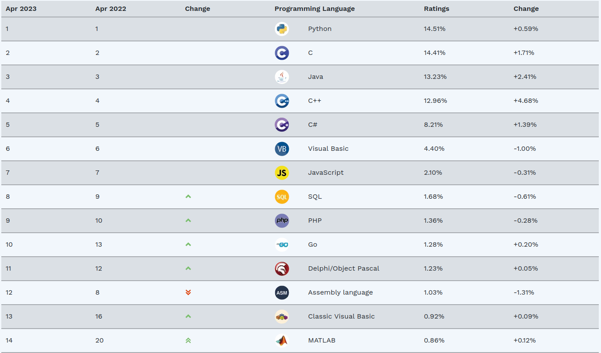

## 为什么要学 XXX 语言?

发现大部分小朋友主要看到了旁边的其他小朋友们或者高年级同学在学什么语言，所以学这门语言。感觉这是有问题的。

这是 2023 年 4 月最流行语言排行榜：

Python 最流行，C 语言第二，Java 第三，C++ 第四, Golang 进入了前十。

就简单的讲下这几门语言的好处和坏处，大家感受一下：
## Python

#### 优点

* 作为现代脚本语言，它比 Shell 的语法更加友好。
* 俗话说的好：C++ 1000 行的代码比 Python 几十行的代码快 0.4 秒。Python 不但语法轻巧，语法糖众多，而且开发库的 API 足够完善。
* 易于理解，学习周期短。
* 解释型语言（不需要像 C 那样先编译后运行，而是可以直接跑）。

#### 适用的场景

* 人工智能
* 网络爬虫
* WEB（Django）

重点放在实现功能上，而不是揪一个细致的语言语法或者性能优化。由于易于理解，编程生态非常好。

#### 缺点

* 跑的慢，这意味着企业的服务的延迟高，吞吐量低，影响客户的使用和降低企业的收益，因此一些大型的服务器系统可能会去选择 C++，Java，Golang 更快的语言，国内大厂主要技术栈上也是阿里是 Java，腾讯是 C++。

## C

#### 优点

* 性能。低级语言就是快！
* 与设备直接打交道。Linux 就是 C 写的！
* 汇编生 C，C 生万物。C++ 等很多语言都是从 C 的功能之上衍生出去的。

#### 适用的场景

* 编写操作系统。
* 编写高性能数据库。
* 编写高性能服务器。

#### 缺点
* 没有系统的封装库，一个高级语言中简单的扩容数组都没有，你得自己造轮子（造的说不定还有 BUG，心累）。
* 手动管理内存，带来负担就是程序员自己需要细心的管理内存，避免内存泄漏。高级语言都在想尽方法改善这个问题。

## C++

#### 优点

* C++ 一直是以高效的著称的。
* 基本完美继承 C 语言亲妈的所有基础功能，所以继承了大部分 C 语言的优点。
* 在 C 之上提供了“面向对象”的功能。简单说就是一个功能更加完善的 `struct`，管理起来会更加便捷。

#### 适用的场景

* 编写高性能数据库。
* 编写高性能服务器。

#### 缺点

* 东西太多。学习路线漫长。Google 当年就是嫌 C++ 语法太繁琐造了 Golang，取其精华，去其糟糠。
* 历史包袱太重。许多“必须品”如网络库如今都没有加到 C++ 标准库中。导致编程爱好者们都自行的造轮子，可大家造的轮子还不能兼容。。。
  > In general, C++ implementations obey the zero-overhead principle: What you don’t use, you don’t pay for. And further: What you do use, you couldn’t hand code any better.
  >
  > 从整体来说，C++ 的实现遵循了零开销原则：你不需要的，无需为他们买单。更有甚者的是：你需要的时候，也不可能找到其他更好的代码了。

  > Bjarne Stroustrup "Foundations of C++"
  >
  > 本贾尼·斯特劳斯特卢普 "Foundations of C++"

  `推荐书籍`  

| 书名                     | 阶级   |
| ------------------------|-------|
| C++ Primer              | 入门   |
| 现代 C++ 白皮书           | 进阶   |
| Effective C++           | 进阶   |
| More Effective C++      | 进阶   |
| Effective Modern C++    | 进阶   |
| 深入探索C++对象模型       | 进阶   |

  `必备网站`
  [cppreference](https://en.cppreference.com/w/)
  [cppreference-zh](https://zh.cppreference.com/w/%E9%A6%96%E9%A1%B5)

  推荐**别看**的书：
  - C++ Primer Plus

  可应用范围:
  - 我是时候告诉你C++能做什么呢？高性能的他可以做操作系统，数据库，游戏引擎，客户端开发, 浏览器内核(chromium)，服务器，低延时系统，分布式系统，机器学习，人工智能，音视频流媒体，移动应用native开发。在硬件领域也很吃的开：嵌入式，单片机(可直接操控硬件)......可谓是包罗万象，但我偷偷告诉你，每个都是一条漫长的路。不要贪心哦。

#### 推荐的练手小项目
- [实现一个 C++ 的 std::list](../project/list-STL.md)

### Java

- 没有什么是一门图灵完备的语言干不了的,但是java给你了一种更简单,更好的选择.

- Java 快速、安全、可靠。从笔记本电脑到数据中心，从游戏控制台到科学超级计算机，从手机到互联网，Java 无处不在！

- 它是一种通用编程语言，旨在让程序员 编写一次，随处运行(WORA)，意味着编译后的Java 代码可以在所有支持 Java 的平台上运行，而无需重新编译。Java 应用程序通常被编译为可以在任何Java 虚拟机(JVM) 上运行的字节码，而不管底层如何计算机体系结构。

java语言自诞生起,就是为了简化开发的存在,java在语言层面屏蔽了大量的细节,经过这么多年的发展,拥有各种各样的第三方包和繁荣的生态,并且尽力去简化开发,让你专注于创造自己特有的应用逻辑和特殊之处,而不拘泥于在语言语法层面的繁琐.

Java是一门面向对象的编程语言，不仅吸收了C++语言的各种优点，还摒弃了C++里难以理解的多继承、指针等概念，因此Java语言具有功能强大和简单易用两个特征。Java语言作为静态面向对象编程语言的代表，极好地实现了面向对象理论，允许程序员以优雅的思维方式进行复杂的编程 。

Java能够自动处理对象的引用和间接引用，实现自动的无用单元收集，使用户不必为存储管理问题烦恼，能更
多的时间和精力花在研发上。

当然,java的可移植性是最强的,也是c++/c 他们很难做到的。  
.......

反正有很多优点,当然也有缺点, java是运行在jvm虚拟机上的语言,需要和python一样解释运行,相比于c/c++, 同样的算法和逻辑会 `慢`一些.

其他资料请查看[百度百科-java](https://baike.baidu.com/item/java/85979)

- [Java和C++的比较-wikipedia](https://en.wikipedia.org/wiki/Comparison_of_Java_and_C%2B%2B)

---

眼光放到 10 年前，Golang 诞生在 2007, Rust 诞生在 2010, 它们作为新世纪的新语言，以它们独特的功能吸引了非常多的编程爱好者，并在一些传统领域占领了一部分的 C++/Java 市场。

## Golang
  C++ 诞生自 1980 年代，虽算不上「古老」，但随着时间的积累，C++在变的更强的同时也积累着众多历史遗留问题。现如今，C++ 仍旧是服务端追求机制性能的最优解之一。但 C++ 也有着自己的缺点，C++ 项目编写难度较大。C++ 对开发团队的编码水平都有着较高的要求。C++ 如同擅长私人定制的高级裁缝，能接受客户刁钻的各自定制化的需求。但并不是每个客户都需要私人定制级别的服务。Golang 则更擅长以较低的成本量产绝大多数客户需要的服务。  
  Golang 通过 `GC` 与 `协程`，极大的简化了并发程序的开发复杂度。不但如此，Golang 还有着统一的模块管理，统一的代码格式化，统一的编译和构建系统等众多现代化语言的特性。

#### 优点：
- Go易于学习
  - 熟练使用 C 语言的人，可以快速上手 Go
- 基于 goroutines 和 channels 的简单并发编程
- 丰富的标准库
- 出色的性能
- 语言层面定义的源代码格式化
- 标准化的测试框架
- Defer声明，降低心智负担
- 在 DevOps 世界中广泛应用

#### 缺点：
- 相对较新
- 原生数据结构太简单
- 对泛型支持差

#### 可应用范围：
- 云
  - docker
  - kubernetes
  - etcd
  - ...
- 分布式
- Web开发
- 网络编程

#### 推荐资料
- [Go 语言之旅](https://tour.go-zh.org/welcome/1) -- 入门
- [Go 语言圣经](https://golang-china.github.io/gopl-zh/) -- 进阶
- [Go 7天练手系列](https://geektutu.com/post/gee.html) -- 第一个项目
- [awesome-Go](https://github.com/avelino/awesome-go) -- 大合集

## Rust

  Rust 也是一门注重效率编程语言。他一直注重 **安全** 与 **无畏并发**。与 C++ 一样，他们提供了很多 **零成本抽象**（zero-cost abstractions）意味着抽象并不会引入运行时开销。

**不推荐在学懂 C++ 前学 Rust**

### 我该学哪门语言？

事实上学哪门语言都可以，大学本科四年，你可能会触及到当今最流行的那几门：C, C++, Java, Golang, Rust, Python, 是的，都碰一遍，它们都是现在国内外大厂实现服务所必要的。

需求 + 兴趣 驱动学习：Courses（MIT6.824 MIT6.830）用啥你学啥。Projects（操作系统，数据库，分布式） 用啥你学啥。未来（或者现在）公司用啥你学啥。

偷懒：哪个学的快学哪个。

执念：我就是觉得这语言天下第一！（Golanger 和 PHPer 在打架）

非主流：Julia，R 语言啥的感觉酷酷的！

#### 如何学习 XXX 语言?

基本所有语言都相同的规律：

1. 看相关书籍/课程。
2. 做书籍相关的 Demo。
3. 刷算法题练基础。
4. 做项目慢慢巩固。

---

**哦，对了，我亲爱的老伙计：「语言只是工具，思想才是根本，只有愚蠢的吐蕃鼠，才把编程语言看得那么重要。」**
